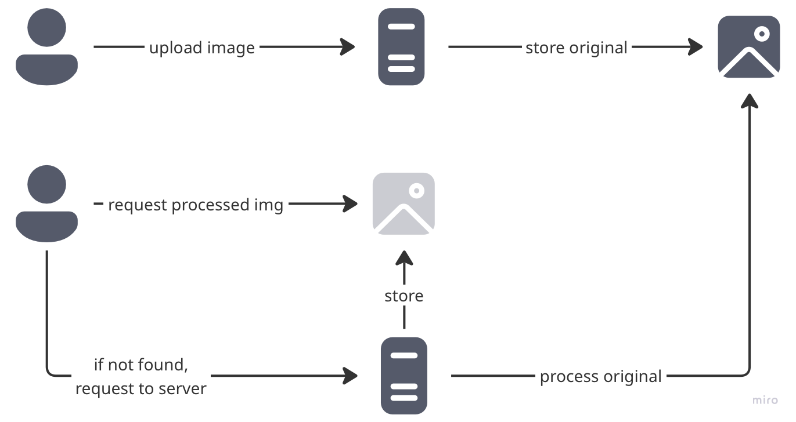

# ImgProxy cache

A transparent caching reverse proxy for [imgproxy](https://imgproxy.net/) that automatically uploads processed images to S3-compatible storage (Tigris, AWS S3, MinIO, etc.).

## What It Does

This application acts as a transparent layer in front of imgproxy:

1. **Receives** image processing requests
2. **Proxies** them to imgproxy for processing
3. **Returns** the processed image to the client immediately
4. **Uploads** the processed image to Tigris or S3 asynchronously for future use

The upload happens in the background, so client responses are not delayed. This creates a "cache-on-write" pattern where every successfully processed image is automatically stored in the target bucket.

## Architecture

```
Client Request
     ↓
[imgproxy-cache :8080] ← This application
     ↓
Response → Client (immediate)
     ↓
S3 Upload (background)
```

The proxy:
- Buffers the complete response in memory
- Sends it immediately to the client
- Spawns a goroutine to upload to S3
- Logs upload success/failure without blocking

.

## Use Cases

- **Persistent Cache**: Ensure processed images are stored durably, even if imgproxy's local cache is cleared
- **Multi-Region**: Process images once, store in Tigris or S3, serve from multiple regions
- **Cost Optimization**: Reduce repeated processing of the same images

## Installation

### Using Docker (Recommended)

The Docker image includes both imgproxy (v3.30) and the Go proxy in a single container:

```bash
docker build -t imgproxy-cache .
docker run -p 8080:8080 \
  -e S3_BUCKET="your-bucket" \
  -e AWS_ACCESS_KEY_ID="your-key" \
  -e AWS_SECRET_ACCESS_KEY="your-secret" \
  imgproxy-cache
```

When the container starts:
1. imgproxy starts on `127.0.0.1:8081` (internal)
2. The Go proxy starts on `:8080` (exposed)
3. Both processes run under supervision - if either exits, the container stops

You can pass imgproxy-specific configuration via environment variables prefixed with `IMGPROXY_`:

```bash
docker run -p 8080:8080 \
  -e S3_BUCKET="your-bucket" \
  -e AWS_ACCESS_KEY_ID="your-key" \
  -e AWS_SECRET_ACCESS_KEY="your-secret" \
  -e IMGPROXY_MAX_SRC_RESOLUTION=16384 \
  -e IMGPROXY_QUALITY=90 \
  imgproxy-cache
```

See [imgproxy documentation](https://docs.imgproxy.net/configuration) for all available options.

## Example client code
### HTML
```html

```

### Elixir (with imgproxy signing)

```elixir
  @doc """
  Renders an image with proxy URL transformation.
  The image URL will be transformed to: <image_proxy_url>/<dimensions>/<image_url>
  """
  attr :src, :string, required: true
  attr :dimensions, :string, required: true
  attr :resize_mode, :string, default: "fit", values: ["fit", "fill"]
  attr :class, :string, default: nil
  attr :alt, :string, default: nil

  def image(assigns) do
    img_path =
      "/rs:#{assigns.resize_mode}:#{assigns.dimensions}:1/dpr:2/g:ce/" <>
        Base.encode64(assigns.src) <> ".webp"

    signature =
      :crypto.mac(
        :hmac,
        :sha256,
        Base.decode16!(
          System.get_env("IMGPROXY_KEY"),
          case: :lower
        ),
        Base.decode16!(
          System.get_env("IMGPROXY_SALT"),
          case: :lower
        ) <> img_path
      )
      |> Base.url_encode64(padding: false)

    full_path = "/" <> signature <> img_path

    assigns =
      assigns
      |> assign(:proxy_src, "#{Application.get_env(:manage, :image_proxy_url)}#{full_path}")
      |> assign(
        :cached_src,
        Application.get_env(:manage, :image_cache_url) <>
          "/" <>
          (:crypto.hash(:md5, full_path)
           |> Base.encode16(case: :lower))
      )

    ~H"""
    
    """
  end
```

## Configuration

### Environment Variables

| Variable | Required | Default | Description |
|----------|----------|---------|-------------|
| `S3_BUCKET` | **Yes** | - | S3 bucket name where images will be stored |
| `S3_FOLDER` | No | `""` | Prefix/folder path within the bucket |
| `S3_ENDPOINT` | No | `https://fly.storage.tigris.dev` | S3-compatible endpoint URL |
| `IMGPROXY_BIND` | No | `:8080` | Address and port for the proxy to bind to |
| `HEALTH_CHECK_TIMEOUT_IN_SEC` | No | `30` | Seconds to wait for imgproxy to become healthy |

### AWS Credentials

The application uses the AWS SDK v2, which automatically loads credentials from:
- Environment variables (`AWS_ACCESS_KEY_ID`, `AWS_SECRET_ACCESS_KEY`)
- Shared credentials file (`~/.aws/credentials`)
- IAM roles (when running on EC2/ECS/Lambda)
- Web identity tokens (when running on EKS)

See [AWS SDK documentation](https://aws.github.io/aws-sdk-go-v2/docs/configuring-sdk/) for full details.

## How Caching Works

### Key Generation

S3 keys are generated by MD5 hashing the imgproxy URL path:

```
Request: /resize:fill:300:300/plain/https://example.com/image.jpg
S3 Key:  a3f8c9d2e1b4f7a6c8d9e2f1b3a4c5d6
```

This ensures:
- **Consistent**: Same URL always maps to the same S3 key
- **Compact**: Keys are fixed-length 32 characters
- **Safe**: No special characters or path traversal issues

### Upload Behavior

- **Only successful responses** (HTTP 200) are uploaded
- **Uploads are asynchronous** - client doesn't wait for S3 confirmation
- **Failed uploads are logged** but don't affect the client response
- **No deduplication** - same request will re-upload (consider implementing checks)

### Storage Structure

```
s3://your-bucket/
  └── processed/              (if S3_FOLDER is set)
      ├── a3f8c9d2e1b4f7a6...  (image 1)
      ├── b2e7d8c1f0a9e3b7...  (image 2)
      └── c9f1a2b3e4d5c6a7...  (image 3)
```

## Usage Example

### Start the Service

```bash
export S3_BUCKET="my-images"
export AWS_ACCESS_KEY_ID="your-key"
export AWS_SECRET_ACCESS_KEY="your-secret"

./imgproxy-cache
```

### Process an Image

```bash
# Request an image through the proxy
curl http://localhost:8080/resize:fill:300:300/plain/https://example.com/cat.jpg > output.jpg

# The processed image is:
# 1. Returned immediately to your curl command
# 2. Uploaded to S3 in the background
```

### Check Logs

```
2025/10/20 10:30:00 INFO Waiting for imgproxy to be ready...
2025/10/20 10:30:01 INFO imgproxy is ready
2025/10/20 10:30:15 INFO Uploaded to S3 path=/resize:fill:300:300/plain/https://example.com/cat.jpg bucket=my-images key=a3f8c9d2e1b4f7a6c8d9e2f1b3a4c5d6
```


## Development

### Testing

```bash
go test -v ./...
```

## Limitations & Considerations

- **Memory Usage**: Entire response is buffered in memory before upload
- **No Retry Logic**: Failed S3 uploads are not retried
- **No Deduplication**: Same image can be uploaded multiple times
- **No Cleanup**: Old/unused images are never deleted from S3
- **No Validation**: Uploads happen even if the same key already exists in S3

## License

[MIT LICENSE](./LICENSE.md)
